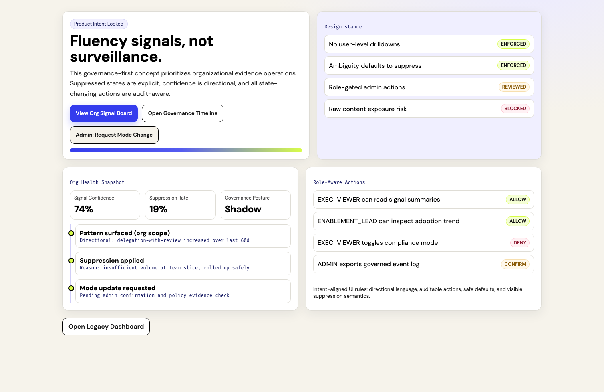

# Governance Concept Visual Diff

Date: 2026-02-16  
Branch: `codex/governance-concept-react-page`

## Purpose

Provide fast visual approval evidence for the frontend governance concept implementation.

## Capture setup

1. Local preview build served from `frontend/dist` on `http://127.0.0.1:4173`
2. Authenticated browser context seeded with:
   - `isAuthenticated=true`
   - `orgId=org-1`
   - `role=ADMIN`
3. Viewport: `1512x982`

## Before

Route: `/legacy-dashboard`  
Screenshot:

## After

Route: `/`  
Screenshot:

## Reviewer checklist

1. Confirm new default route renders governance concept layout.
2. Confirm legacy dashboard remains available at `/legacy-dashboard`.
3. Confirm visual direction reflects governance-evidence operations framing.

