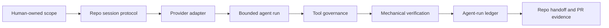

# Agentic Execution Harness

## Purpose

This document defines FluencyTracr's canonical agentic execution harness layer. It is a development infrastructure layer for repo work, investigation, and verification at scale. It is not a FluencyTracr customer product surface, not a customer telemetry source, and not a new value-realization event stream.

The layer turns existing harness pieces into one architecture spine:

## Canonical Source Map

| Need | Canonical source | Notes |
| --- | --- | --- |
| Product and repository invariants | `AGENTS.md` | Read before any work. `CODEX.md` is intentionally a short pointer. |
| Every-session startup protocol | `docs/agent/SESSION_START.md` | Canonical entrypoint for all coding agents. |
| Active work state | `.project/WORK_QUEUE.json` and `.project/PROGRESS.md` | Human-owned queue structure; agents update status and progress only when the queue track is active. |
| Cross-session harness checklist | `harness/feature_list.json` | Flip `passes` only after mechanical verification. |
| Cross-session harness handoff | `harness/agent-progress.txt` | Optional handoff log; never a substitute for `.project/PROGRESS.md` during queue work. |
| Verification guidance | `docs/agent/EVALUATION.md` | Defines proportional mechanical checks. |
| Provider-neutral agent-run telemetry | `docs/contracts/agent-run/README.md` | Development-harness observability only. |
| Cursor adapter | `.cursor/rules/` and `docs/agent/cursor-agent-harness.md` | Adapter to the canonical protocol, not a parallel protocol. |
| OpenAI Agents SDK adapter | `integrations/openai-agents/` and `docs/agent/openai-agents-harness.md` | Optional sidecar for orchestration and specialist delegation. |
| Review routing | `agents/review/` | Review guidance only; not active work state. |
| MCP product adapter | `packages/fluencytracr-mcp/` | Customer/value evidence tools, not agent-run state storage. |

Do not create another live `WORK_QUEUE`, `PROGRESS`, feature list, agent-run contract, or provider-specific source of truth.

## What Exists Today

Implemented:

- Repo startup protocol under `docs/agent/SESSION_START.md`.
- Queue governance under `.project/`.
- Long-running checklist and handoff harness under `harness/`.
- Provider-neutral agent-run event contract `AR_2026_05`.
- Cursor project rules that route Cursor back to the repo protocol.
- Optional OpenAI Agents SDK sidecar that can read allowlisted harness documents.
- Review routing docs under `agents/review/`.

Implemented as adapters:

- Cursor rules and docs.
- OpenAI Agents SDK sidecar.
- Claude and Codex entrypoint aliases.

Documentation-stage:

- Durable agent-run ledger semantics.
- Tool-call approval policy across providers.
- Eval/replay of completed agent runs.
- Cross-provider observability dashboards for harness reliability.

Explicitly out of scope for this layer:

- Customer-facing AI value claims.
- Product canonical events or suppression reasons.
- Customer telemetry ingestion.
- Raw prompt, raw response, file-content, diff, email, or direct identifier capture.
- Individual agent, employee, team, manager, or department labels.

## Execution Spine

1. A human or queue item defines a bounded unit of work.
2. The agent reads `AGENTS.md`, `docs/agent/SESSION_START.md`, and the relevant track documents.
3. A provider adapter loads only canonical repo context.
4. The agent performs one bounded run with explicit tool permissions.
5. Tool calls are governed before execution and summarized after execution.
6. Mechanical verification proves the touched surface.
7. The run writes durable handoff state to the canonical repo files.
8. PR evidence cites changed files, verification, and remaining risk.

## Provider Adapters

Provider adapters translate a runtime into the canonical harness. They must not fork the protocol.

- Cursor uses `.cursor/rules/` for project-local routing and MCP configuration.
- OpenAI Agents SDK uses `integrations/openai-agents/` for code-first orchestration, handoffs, tool approvals, MCP tool access, and trace export.
- Codex and Claude Code use root entrypoints and the same repo protocol.
- Future adapters must map to `AR_2026_05` rather than inventing their own run format.

## Agent Roles

Role names are execution roles, not durable identities:

- **Planner:** binds the work item, risks, touched paths, and verification plan.
- **Coding agent:** makes bounded implementation or documentation changes.
- **Bug agent:** investigates failures, reproduces them, and proposes the smallest fix.
- **Evaluator:** runs mechanical checks and records results.
- **Reviewer:** checks scope, invariants, privacy, and maintainability.
- **Integrator:** stages only intended files, writes PR evidence, and resolves review feedback.

Subagents should receive an explicit handoff: current scope, relevant files, forbidden changes, expected output, and the single bounded task. They should not inherit broad chat context as the source of truth.

## Tool Governance

Tool governance must happen at tool boundaries, not only at final answer review.

Required controls:

- Allowlisted document reads for harness state.
- Explicit write scopes for worker agents.
- Approval gates for external network, production, secrets, deploy, or destructive actions.
- Output validation that blocks raw prompts, raw responses, file content, diffs, emails, direct identifiers, and person-level judgments from agent-run events.
- Mechanical verification before a run is marked complete.

OpenAI Agents SDK references:

- Guardrails: <https://openai.github.io/openai-agents-js/guides/guardrails>
- MCP: <https://openai.github.io/openai-agents-js/guides/mcp/>
- Tracing: <https://openai.github.io/openai-agents-python/tracing/>

Cursor references:

- Rules and context: <https://docs.cursor.com/en/cli/using>
- MCP for CLI: <https://docs.cursor.com/cli/mcp>

Harness references:

- OpenAI harness engineering: <https://openai.com/index/harness-engineering/>
- Anthropic long-running harnesses: <https://www.anthropic.com/engineering/effective-harnesses-for-long-running-agents>

## Agent-Run Ledger

The agent-run ledger is the future durable record of agentic work. It should store normalized `AR_2026_05` event batches and derived run summaries. It must remain development-harness telemetry only.

The ledger may support:

- Run start and completion state.
- Tool start, tool end, and tool failure summaries.
- Delegation and handoff summaries.
- Verification result references.
- PR, branch, commit, and check references.
- Error class and recovery status.

The ledger must not store:

- Raw prompts or responses.
- Raw file content.
- Diffs or patches.
- Secrets.
- Emails or direct person identifiers.
- Employee, team, manager, or department labels.
- Customer product telemetry.

## Relationship to Product Invariants

This layer does not alter the nine FluencyTracr invariants. Agent-run telemetry is development infrastructure and must not be treated as customer evidence. It must not add canonical events, suppression reasons, thresholds, admin overrides, individual attribution, rankings, ROI computation, or causal claims.

## Deprecation and Quarantine Rules

Deprecate or remove duplicates when they reproduce canonical harness content:

- Full tracked tool worktrees should be removed from source control and ignored.
- Provider docs should point to canonical repo protocol documents instead of copying long policy text.
- Entry-point aliases are allowed only when they are symlinks or short pointers.
- Historical artifacts may remain if clearly marked archival and not used as active state.

## Readiness Checklist

- Canonical source map is documented.
- Provider adapters point back to the canonical protocol.
- Agent-run contract blocks raw content and direct identifiers.
- Worktree and local runtime caches are ignored.
- Verification commands are documented in `docs/agent/EVALUATION.md`.
- No duplicate live task state exists outside `.project/` and `harness/`.

## Open Questions

- Which storage backend should hold the future ledger: local artifacts, database table, or append-only object store?
- Which tool calls require human approval in each provider adapter?
- Which derived run metrics are useful without creating individual or team labels?
- What minimum event sequence is required before an agent run is replayable?
- How should provider traces be redacted before any export leaves a local development boundary?
