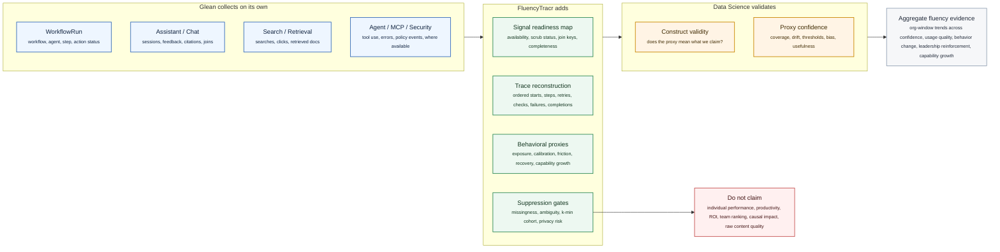

# FluencyTracr: Behavioral Measurement Model

Audience: Juhi Singh, Data Science Lead

Use this version with a data science audience. The core point: Glean already collects much of the structured behavioral telemetry; FluencyTracr turns that telemetry into defensible, aggregate fluency evidence through readiness checks, feature engineering, suppression gates, and validation.

## Ownership Boundary

| Layer | What it does | Owned by |
| --- | --- | --- |
| Event collection | Captures structured product usage and workflow events: WorkflowRun, Assistant/Chat, Search/Retrieval, Agent runs/steps, Actions, MCP usage, AI security, and product snapshots. | Glean |
| Signal readiness | Confirms which log families are available, scrubbed, joinable, complete, and safe to use for a specific org-window. | FluencyTracr + Glean data owner |
| Behavioral derivation | Reconstructs workflow traces, derives passive behavior proxies, applies missingness/privacy gates, and maps evidence to fluency dimensions. | FluencyTracr |
| Construct validation | Tests whether derived proxies are credible, stable, explainable, and useful enough for measurement. | Data Science |

**Simple framing:** Glean collects events. FluencyTracr derives behavioral evidence. Data Science validates whether the evidence is credible enough to use.

## Measurement Model, With Ownership Boundary

```mermaid
flowchart LR
  classDef input fill:#eef6ff,stroke:#356bba,stroke-width:1.5px,color:#10233f
  classDef transform fill:#f6f7f9,stroke:#8d98a8,stroke-width:1.3px,color:#202938
  classDef feature fill:#fff,stroke:#7b8ca3,stroke-width:1.2px,color:#202938
  classDef gate fill:#fff4e5,stroke:#c98600,stroke-width:1.5px,color:#3f2a00
  classDef output fill:#edf8f1,stroke:#2f8a55,stroke-width:1.5px,color:#12351f
  classDef safety fill:#fff0f0,stroke:#c65353,stroke-width:1.5px,color:#421313

  I["1. Passive event sources<br/><span style='font-size:12px'>Assistant, Search, Agents, tools, workflow systems, governance logs</span>"]:::input
  C["2. Canonical event contract<br/><span style='font-size:12px'>metadata only; no raw prompts, outputs, documents, transcripts, screenshots, or user identifiers</span>"]:::transform
  U["3. Unit of analysis<br/><span style='font-size:12px'>workflow execution = workflow_id + execution_id</span>"]:::transform
  R["4. Trace reconstruction<br/><span style='font-size:12px'>ordered sequence of starts, steps, retries, checks, errors, completions, abandonments</span>"]:::transform

  subgraph F["5. Behavioral Feature Families"]
    direction TB
    F1["Adoption and exposure<br/><span style='font-size:12px'>new tool use, feature trials, template reuse</span>"]:::feature
    F2["Work shaping<br/><span style='font-size:12px'>constraints, acceptance criteria, scope narrowing, strategy shifts</span>"]:::feature
    F3["Trust calibration<br/><span style='font-size:12px'>verification, counterfactual checks, policy checks, post-run review</span>"]:::feature
    F4["Friction and iteration<br/><span style='font-size:12px'>retry loops, undo churn, latency buckets, abandonment</span>"]:::feature
    F5["Recovery behavior<br/><span style='font-size:12px'>error-to-retry-to-success, contradiction resolution, agent redirects</span>"]:::feature
    F6["Diffusion and reuse<br/><span style='font-size:12px'>artifact forking, peer artifact engagement</span>"]:::feature
    F7["Risk and agent oversight<br/><span style='font-size:12px'>safe-path routing, sensitive mode, stop interventions, permission elevation, repeated failures</span>"]:::feature
  end

  G["6. Validity, missingness, and safety gates<br/><span style='font-size:12px'>schema validity, full state coverage, minimum signal set, ambiguity suppression, k-min cohort threshold</span>"]:::gate
  O["7. Aggregate outputs<br/><span style='font-size:12px'>workflow-level pattern mix and interpretation hints for enablement and governance</span>"]:::output
  X["Suppressed result<br/><span style='font-size:12px'>thin evidence, ambiguity, incomplete execution, or privacy risk</span>"]:::safety

  I --> C --> U --> R --> F --> G
  G -- passes --> O
  G -- fails closed --> X

  O2["What can be claimed<br/><span style='font-size:12px'>observed workflow behavior patterns: stability, friction, recovery, verification, oversight</span>"]:::output
  O3["What cannot be claimed<br/><span style='font-size:12px'>individual performance, productivity, ROI, output quality, team ranking, causal impact</span>"]:::safety

  O --> O2
  O --> O3
```

## Data Science Talk Track

- FluencyTracr is a behavioral telemetry and feature-engineering layer, not a productivity model.
- The observation unit is a workflow execution, not a person.
- Raw content is intentionally out of scope. The system relies on structured event metadata, sequence order, timestamps, coarse role/function keys, and safe workflow identifiers.
- The main derived constructs are behavioral proxies: verification behavior, iteration depth, recovery behavior, abandonment, friction, safe-path routing, reuse, and agent oversight.
- The validity posture is fail-closed: if event coverage, ambiguity, cohort size, or minimum evidence is insufficient, the result is suppressed instead of inferred.
- The data science question is not "can we score fluency?" It is "are these observable workflow behaviors credible proxies for adoption quality, trust calibration, friction, recovery, diffusion, and oversight?"

## Passive Behaviors Tracked

| Feature family | Passive behaviors represented |
| --- | --- |
| Adoption and exposure | First observed tool use, exploratory feature trials, template reuse |
| Work shaping | Prompt strategy shifts, early constraints, acceptance criteria, scope narrowing |
| Trust calibration | Verification starts, time-to-verify buckets, counterfactual checks, policy checks, post-run verification |
| Friction and iteration | Rapid abandonment, dense retry loops, undo churn, latency buckets |
| Recovery behavior | Conflict resolution, error-to-retry-to-success paths, agent redirect behavior |
| Diffusion and reuse | Artifact forking, peer artifact engagement |
| Risk and agent oversight | Safe-path escalation, sensitive-mode activation, review before agent execution, stop interventions, permission elevation attempts, repeat failure loops, silent-success risk |

## Measurement Caveats To Say Out Loud

- These are observed behavioral proxies, not latent fluency scores.
- Missing telemetry is treated as missingness, not evidence of absence.
- Workflow mix, connector coverage, and instrumentation drift can affect interpretation.
- Outputs should be used to prioritize enablement, workflow redesign, and governance review, not to evaluate individuals or rank teams.

## Questions Juhi Is Likely To Ask

| Question | Recommended answer |
| --- | --- |
| What is the unit of analysis? | A workflow execution, aggregated to workflow/function/org views. Never an individual. |
| Are these labels model predictions? | V1 is deterministic rule-based classification over structural event sequences, with suppression when evidence is insufficient. |
| How do you handle missingness? | Missing or incomplete telemetry fails closed through full-state-coverage and minimum-signal gates. Missingness is not interpreted as behavior. |
| What are the constructs? | Adoption/exposure, work shaping, trust calibration, friction/iteration, recovery, diffusion/reuse, and risk/agent oversight. |
| What validation comes first? | Construct validity: whether the feature families are credible observable proxies for the behavior claims. |

## Recommended Framing

**Best one-sentence explanation:**
FluencyTracr measures aggregate AI-workflow behavior from safe metadata, then suppresses anything that cannot be interpreted defensibly.

**What to validate first with Juhi:**
Whether the feature families are credible proxies for the constructs we claim: adoption, trust calibration, friction, recovery, diffusion, and oversight.

## Source Anchors

- Product contract: `artifacts/PRD_V1_BEHAVIORAL_OBSERVABILITY.md`
- Canonical V0 behavior list: `docs/behaviors/V0_Behaviors_and_Formulas.md`
- Behavioral signal family spec: `docs/BEHAVIORAL_SIGNALS_SPEC.md`
- V1 input event contract: `FluencyTracr_V1_Event_Contract.md`
