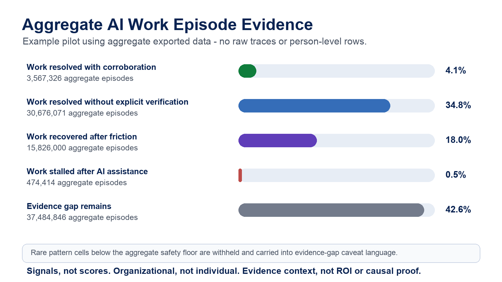
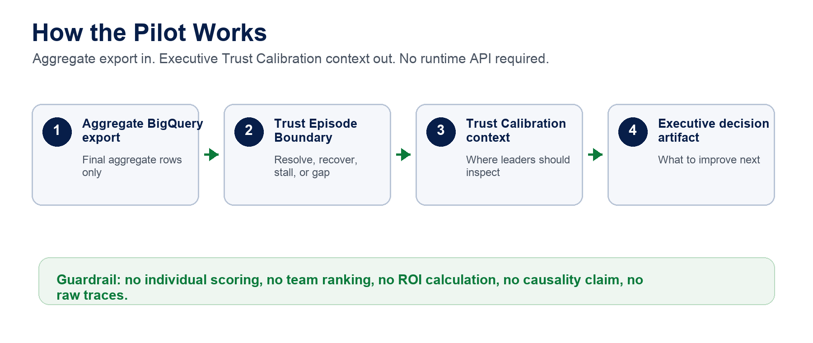

# AI Work Evidence Pilot Brief: Trust Calibration Context

External-facing example based on aggregate pilot evidence. Replace the example organization label and citations with a customer-approved aggregate evidence package before using in a customer-specific readout.

## Executive Takeaway

FluencyTracr turns aggregate AI work telemetry into evidence about where AI-assisted work resolves, recovers after friction, stalls, or lacks enough evidence for confident interpretation. In this sample pilot, the readout covers 88,028,657 aggregate AI work episodes across seven approved business days.

The signal is useful because it goes beyond citation clicks and thumbs feedback. It looks at what happens after AI-assisted work hits friction: does work recover, continue, stall, or disappear into an evidence gap?

This is Trust Calibration Context. It is not a trust score, not a citation-click metric, and not a correctness detector. It does not identify, score, rank, or evaluate employees.

## What The Pilot Shows

- Work resolved with corroboration: 3,567,326 aggregate episodes (4.1%).
- Work resolved without explicit verification: 30,676,071 aggregate episodes (34.8%).
- Work recovered after friction: 15,826,000 aggregate episodes (18.0%).
- Evidence gap remains: 37,959,260 aggregate episodes (43.1%).

Evidence gap composition:

- True downstream-evidence gap: 37,484,844 aggregate episodes. These episodes exist, but the aggregate record does not show enough downstream behavior to interpret whether AI-assisted work resolved, recovered, stalled, or was verified.
- Ambiguous boundary fold-in: 474,414 aggregate episodes. This ambiguous boundary fold-in stays inside evidence-gap language because trace, run, session, or action keys may overlap.
- Small-cell safety fold-in: present below the aggregate safety floor; exact count withheld.

Evidence quality and reliability:

- Product-episode normalization: 246,962,102 raw candidate keys were compressed to 88,028,657 aggregate AI work episodes, preventing a 2.8x overcount from entering the executive readout.
- Key-confidence coverage: 99.95% high-confidence trace, run, or action coverage.
- Interpretation completeness: 56.9% of episodes have enough aggregate evidence to classify as resolved, resolved without explicit verification, or recovered after friction.
- Boundary ambiguity: 0.5% of all episodes were folded into evidence-gap language instead of being published as precise stalled values.

Rare pattern cells below the aggregate safety floor are withheld from pattern rows and carried into evidence-gap caveat language.

Rows with incomplete, ambiguous, or undocumented source coverage are withheld from pattern rows and carried into evidence-gap caveat language.

Three signals matter most for leaders:

- Recovery after friction appears in 18.0% of aggregate episodes. This suggests AI-assisted work often continues after failure, pause, skip, cancellation, or other friction.
- Work resolved without explicit verification appears in 34.8% of aggregate episodes. This can be healthy in low-risk workflows, but it needs workflow-risk and source-coverage context.
- The evidence gap remains 43.1%. It is mostly a true downstream-evidence gap, with ambiguous boundary rows and small-cell safety fold-ins kept in caveated evidence context. It must not be upgraded into healthy trust, poor trust, value, or causality.

## Why Executives Should Care

Most AI adoption dashboards show usage. FluencyTracr adds work evidence: whether aggregate AI-assisted work appears to resolve, recover, stall, or lack enough source coverage to interpret safely.

That gives leaders a practical operating view:

- Where AI is helping work move through friction.
- Where teams may be accepting output without enough corroborating evidence.
- Where workflow design or source coverage needs repair before scaling.
- Where outcome evidence is needed before making value claims.

## What A Customer Would Provide

No API is required for this pilot phase. A customer pilot can run from an aggregate CSV export generated in the customer environment.

Minimum input package:

- Approved aggregate scope: workflow, AI surface, cohort, approved segment, role family, or function where aggregate-safe.
- Aggregate Trust Episode Boundary CSV export with final aggregate rows only.
- Source coverage declaration for trace, run, action, feedback, citation/source, continuation, completion, failure, pause, skip, and cancellation evidence.
- Customer-owned outcome evidence only if the customer wants to move beyond evidence readiness.

The pilot does not require enablement-system access, training records, survey joins, HR data, or person-level employee data.

## Governance Guardrails

This pilot:

- does not calculate ROI,
- does not establish causality,
- does not prove output correctness,
- does not create productivity claims,
- does not add canonical events,
- does not add suppression reasons,
- does not create runtime APIs or schemas,
- does not ingest raw traces into FluencyTracr,
- does not identify, score, rank, or evaluate employees,
- does not produce team or manager rankings.

## Recommended Next Step

Use this brief as the source for an executive deck and a customer pilot checklist. The next commercial step is not an API. It is a customer-safe pilot packet:

1. BigQuery aggregate export template.
2. Source coverage checklist.
3. Approved aggregate segment intake form.
4. Executive deck based on this brief.
5. Customer-specific readout generated from their aggregate export.

Only after two or three pilots show repeated demand for persistence or self-service access should FluencyTracr consider an aggregate-results API.

## Evidence References

- Trust Episode Boundary input contract proposal.
- V4 Trust Episode Boundary validation readout.
- Product-episode dedup readout.
- Key-confidence coverage readout.
- Pilot executive readout generated from aggregate CSV export.
